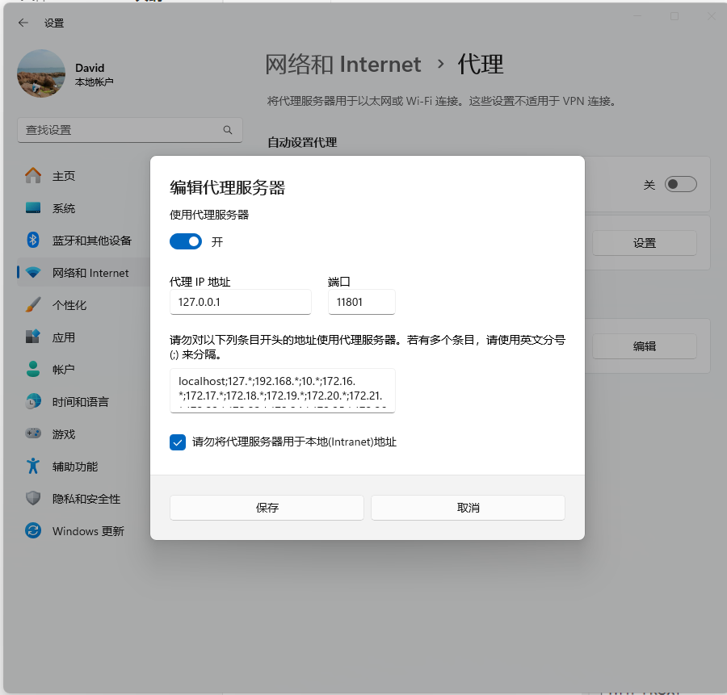
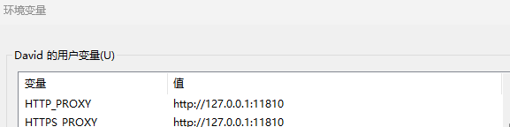

# 本仓库用于解决windows系统codex要重新连接5次才能进行思考的问题

有两种解决方式

## 将.env 文件放到C:\Users\用户名\\.codex 文件夹中  将文件中的代理端口 换成 代理软件的端口 一般是7980

```env
HTTP_PROXY = "http://127.0.0.1:代理端口"
HTTPS_PROXY = "http://127.0.0.1:代理端口"
```

如果不知道软件的端口号可以 打开**设置** -> 网络和Internet  —> 手动设置代理 ->编辑 就可以看到端口号了



## 也可以将HTTP_PROXY 和 HTTPS_PROXY设置到环境变量



然后重启codex 就解决了
